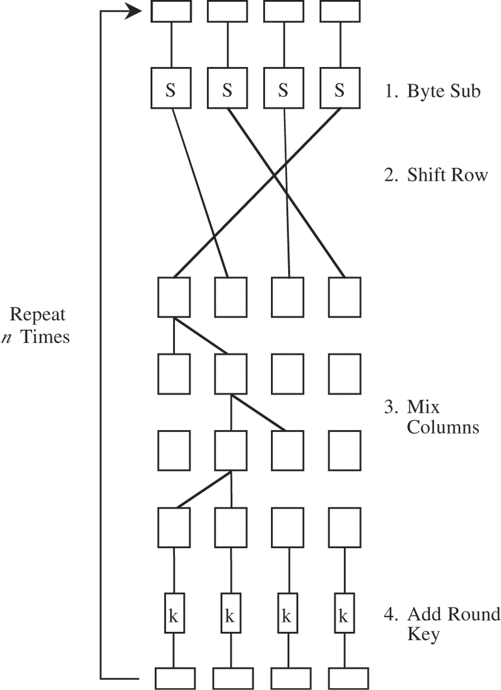

# Cryptography docs

## Choice of protocol

For this project we want to use a symmetric encryption scheme where the secret key is only held by our server. In researching different options for symmetric cryptosystems we landed on using AES (Rijndael) with a 256 bit key. The current secure AES-256 cryptosystem arranges messages in a 4x4 byte matrix and performs 14 rounds of encryption in order to generate cipher text. In each round bytes are substituted, shifted row-by-row, multiplied with a polynomial column-by-column, and XORed with a subkey derived from the original secret key. The diagram below shows the encryption flow for each round.



<!---->

## Justification

The AES-256 protocol was chosen because it is secure against the majority of attacks and is ubiquitous in cybersecurity practice. 


## Implementation of protocol

This protocol will be implemented in Python using the AES class from the popular Python cryptography library PyCryptodome.

## Example output message

```
5c80a163f47b0435c3c03ea80e736b8ae30d69b5002d2152c52efc1b3c6afb68aceb776cb929134b700d2e60e0c8532dce5cb755f4f8296ed2a18318f2bb93d3fb3043e4825092213e21773a744207c6b48957c01e9c54ae250026376da19f792e7508e58e789346045600197c15a4bef53b21ede07a5d78e0dcc37244120eb85d836bbb9a1279b1da99a24225942f7b33303462343735643161306435656261396663376533643832313037366338626330663333623831336434323937376133646331393032623634393234636338304b475d1a0d5eba9fc7e3d821076c8bc0f33b813d42977a3dc1902b64924cc8
```


## References

- Daemen, J., & Rijmen, V. (1999). AES proposal: Rijndael.
- https://github.com/Legrandin/pycryptodome


# TODO

- Include some cryptanalysis about how long it would take to crack in **Justification**